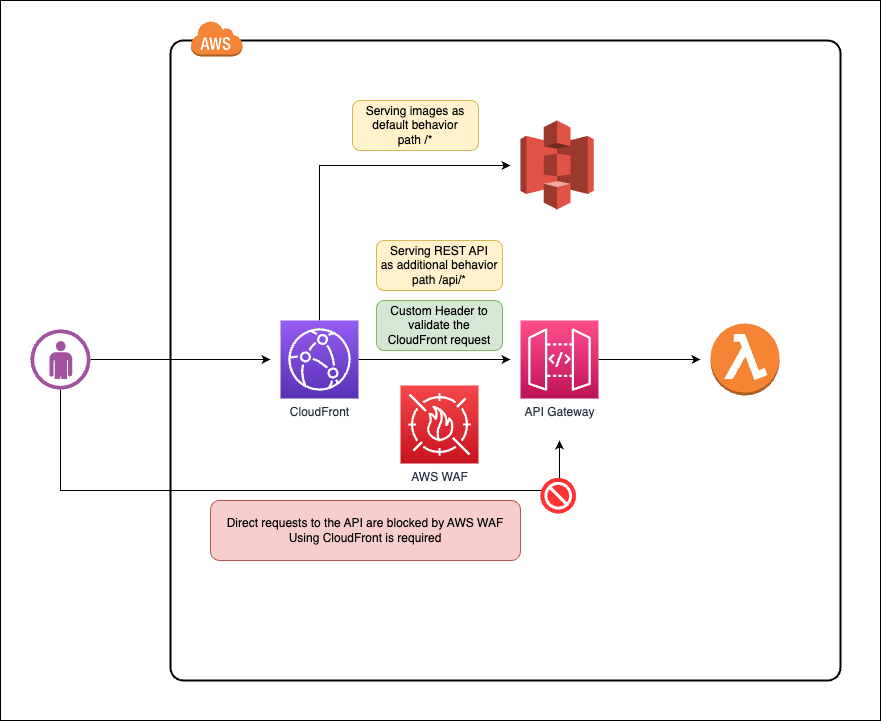

# REST API in Amazon API Gateway with Amazon CloudFront Behavior using AWS WAF for API protection

CDK example of:

- Using multiple behaviors in Amazon CloudFront:
  - Default behavior serving assets from Amazon S3 bucket and an additional behavior serving a REST API from Amazon API Gateway in a custom path
- Using AWS WAF for API protection:
  - Using AWS WAF to protect the REST API from malicious requests and blocking requests from the internet allowing only CloudFront to access the API with a custom header

Final Architecture:

Extra resources:

- [Prevent requests from accessing API directly](https://www.wellarchitectedlabs.com/security/300_labs/300_multilayered_api_security_with_cognito_and_waf/3_prevent_requests_from_accessing_api_directly/)
- [Protecting your API using Amazon API Gateway and AWS WAF — Part 2](https://aws.amazon.com/blogs/compute/protecting-your-api-using-amazon-api-gateway-and-aws-waf-part-2/)
- [How to enhance Amazon CloudFront origin security with AWS WAF and AWS Secrets Manager](https://aws.amazon.com/blogs/security/how-to-enhance-amazon-cloudfront-origin-security-with-aws-waf-and-aws-secrets-manager/)
